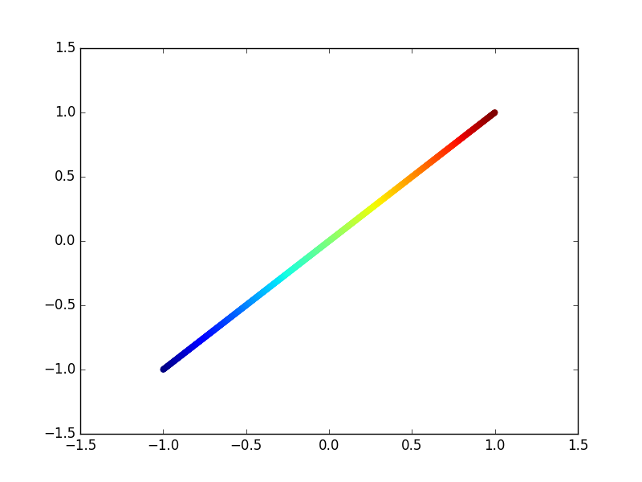
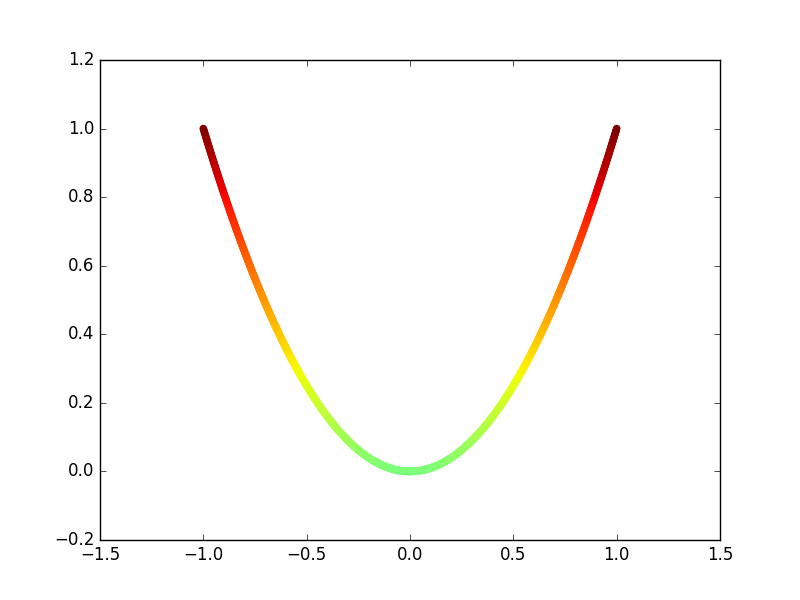
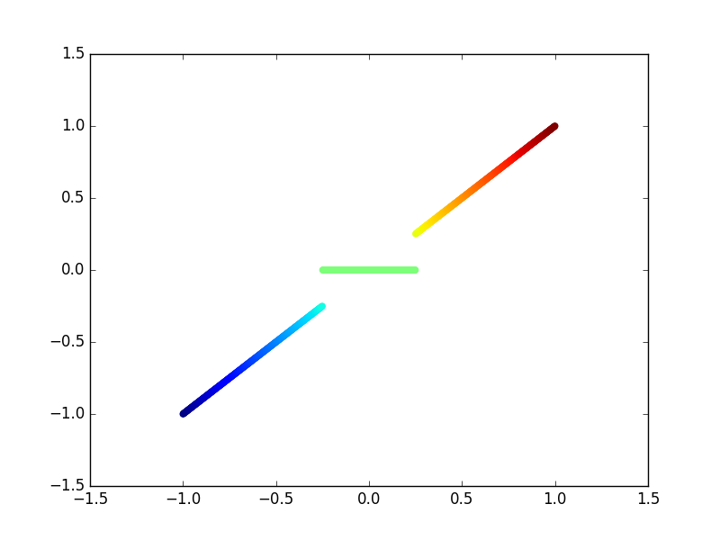
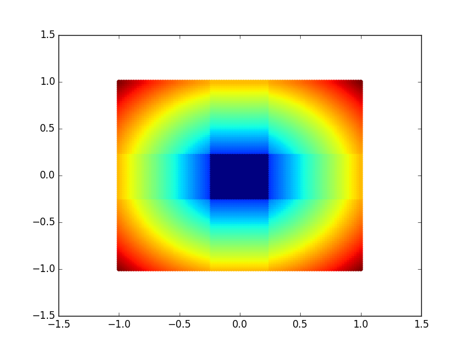
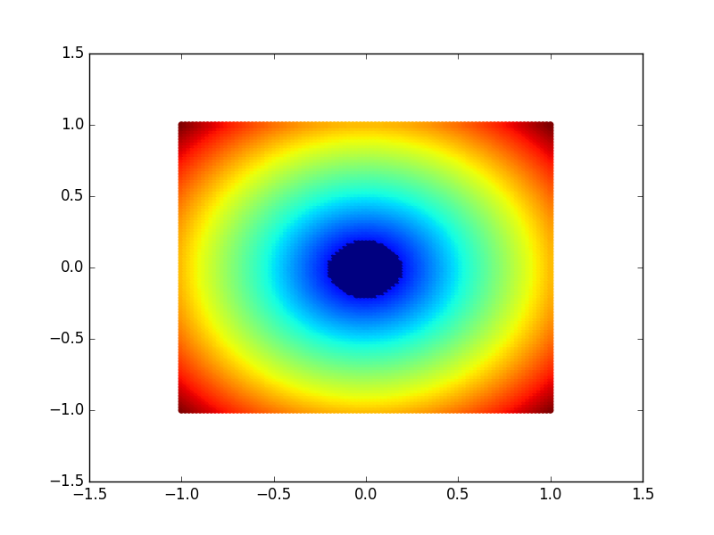
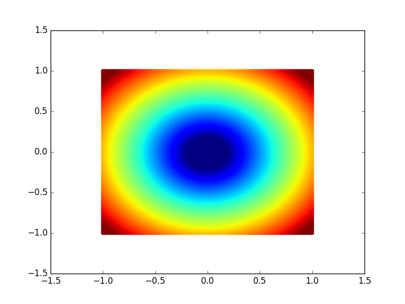

Joystick Transform Plotter
==========================

A joystick transform function plotter for Python.
Maps controller input through an equation and plots it as either a 2d representation of a 3d graph or a 2d graph for a single axis.

Requires matplotlib

```Python
## examples
plot3d(mag)

def thresh(x, y, t):
    if abs(x) < t:
        x = 0
    if abs(y) < t:
        y = 0
    return mag(x, y)

plot3d(lambda x, y: thresh(x, y, 0.25))

def square(x):
    return x**2

plot2d(square)
plot2d(lambda x: x)

def thresh2(x, t):
    if abs(x) < t:
        return 0
    return x

plot2d(lambda x: thresh2(x, 0.25))
```

## A linear transform over a single axis


## A square transform over a single axis


## A deadzone transform over a single axis


## A axial deadzone transform over both axes


## A radial deadzone transform over both axes


## A scaled radial deadzone transform over both axes

